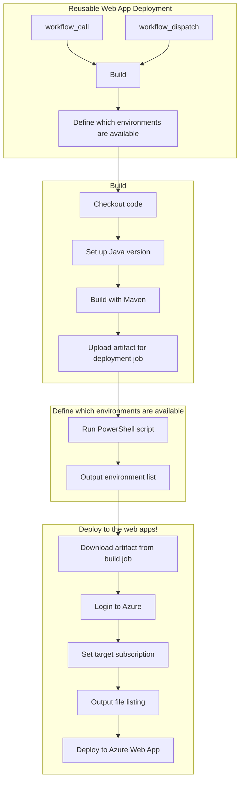
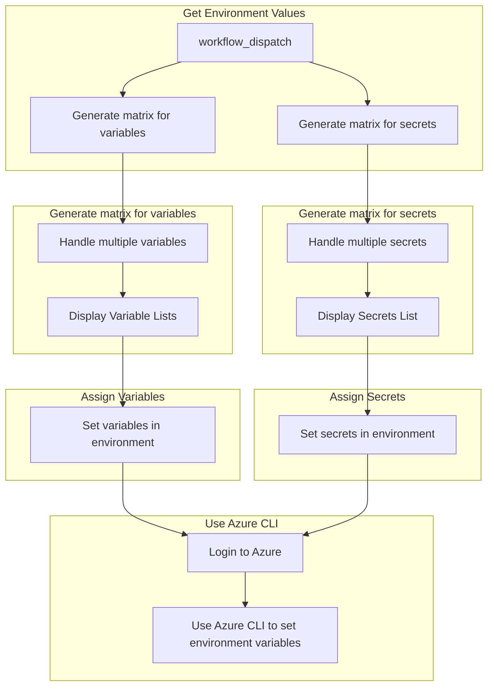

# Reusable Workflows

## Deploy Web App Workflow

This workflow contains GitHub actions for deploying web applications. The workflow provides flexibility in defining environments and allows for easy deployment to different environments.

## Deploy Web App Workflow Inputs

| name | description | type | required | default |
| --- | --- | --- | --- | --- |
| `runs_on` | <p>The type of runner to use (e.g., self-hosted)</p> | `string` | `true` | `""` |

## Deploy Web App Workflow Usage

```yaml
jobs:
  job1:
    uses: ***tj-internal-development/gha-reusable-workflows/.github/workflows/deploy-webapp.yml@main
    with:
      runs_on:
      # The type of runner to use (e.g., self-hosted)
      #
      # Type: string
      # Required: true
      # Default: ""
```

### Deploy Web App Workflow Diagram



## Set Environment Variables Workflow

This workflow contains GitHub Actions for retrieving environment variables and secrets and assigning them to an Azure Web App. The workflow provides flexibility in defining the variables and secrets and allows for easy configuration of environment-specific values.

## Set Environment Variables Workflow Inputs 

| name | description | type | required | default |
| --- | --- | --- | --- | --- |
| `variables` | <p>A comma separated list of GitHub VARIABLES</p> | `string` | `true` | `""` |
| `secrets` | <p>A comma separated list of GitHub SECRETS</p> | `string` | `true` | `""` |
| `environment` | <p>GitHub environment name to use</p> | `string` | `false` | `dev` |

## Set Environment Variables Workflow Usage

```yaml
jobs:
  job1:
    uses: ***tj-internal-development/gha-reusable-workflows/.github/workflows/set-env-vars.yml@main
    with:
      variables:
      # A comma separated list of GitHub VARIABLES
      #
      # Type: string
      # Required: true
      # Default: ""

      secrets:
      # A comma separated list of GitHub SECRETS
      #
      # Type: string
      # Required: true
      # Default: ""

      environment:
      # GitHub environment name to use
      #
      # Type: string
      # Required: false
      # Default: dev
```

### Set Environment Variables Workflow Diagram


